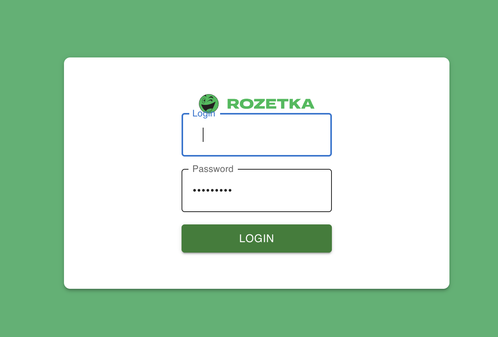
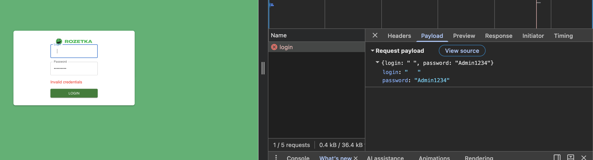

# BUG-001 — Login with three whitespace characters

## Steps to Reproduce

1. Open the Login page.
2. Enter three whitespace characters in the Login field.
3. Enter `Admin1234` in the **Password** field.
4. Click the **Login** button.

## Expected Result

- The Login field rejects whitespace-only input.
- A validation message is displayed indicating that the Login field cannot contain only whitespace characters.
- The user is not authenticated.
- The user remains on the Login page.

## Actual Result

- Three whitespace characters pass the Login field validation.
- No validation message is displayed.
  -The login request is sent to the server.

## Severity

Medium

## Priority

Medium

## Evidence

### Validation Result

### Network Request

