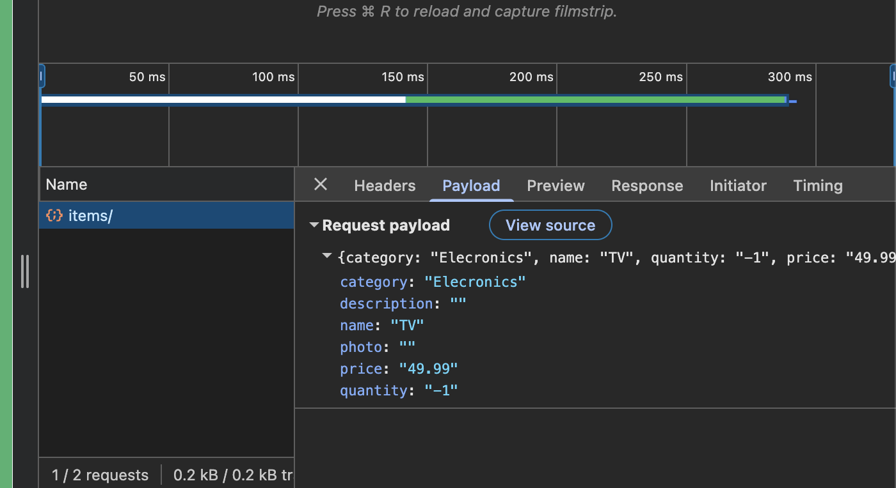
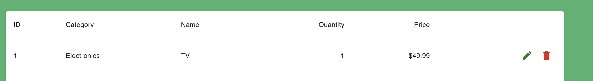

# BUG-006 — Edit product with negative Price

## Steps to Reproduce

1. Click the Edit button for the product.
2. Change the Category from `Electronics` to `Clothes`.
3. Change the Name from `Keyboard` to `Shorts`.
4. Change the Quantity from `10` to `4`.
5. Change the Price from `49.99` to `-1`.
6. Leave the Photo URL field empty.
7. Leave the Description field empty.
8. Click the Submit button.

## Expected Result

- A validation message is displayed indicating that the Price cannot be negative.
- The product is not updated.
- The product does not appear in the Products table with the new values.

## Actual Result

- The product is successfully updated with Price `-1`.
- No validation message is displayed.
- The product appears in the Products table with Price `-1`.

## Severity

Medium

## Priority

Medium

## Evidence

### Products Table

